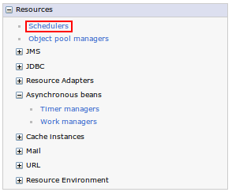
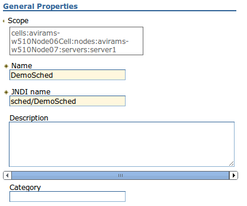
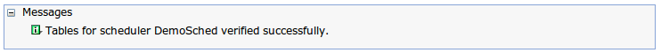
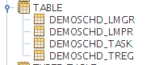

# Introduction

Schedulers are persistent and transactional timer services that run Enterprise JavaBean methods or send Java Message Service messages. 

The scheduler service provides the ability to reliably process workloads using parallel processing and schedule resource-intensive tasks to process during low traffic off-hours. 

You can create multiple schedulers within a single server, cluster, node or cell. Each configured scheduler is an independent task scheduling engine that has a unique Java Naming and Directory Interface (JNDI) name, persistent storage device and daemon.

EJB Timers use a custom scheduler instance and are configurable to use any scheduler. 

#### Why use the scheduler service directly instead of EJB Timers ?

1. When the default settings of EJB Timers does not match your needs and you can't change them. 
    * On a cluster, EJB Timers run on each cluster member separately, any task scheduled will be invoked on the same cluster member, if the cluster member is down, the task will not be invoked until it is recovered. 
    * If the EJB Timers will be configured to work with a Scheduler to resolve this issue it might break other applications that were relying on the default behavior. 

2. When different configuration is required for different schedulers (Different databases, WorkManager thread pools, etc) 

3. When creating tasks that only send JMS Messages (no need for EJB) 

4. When Programmatic task monitoring capability is needed (with the use of the `NotificationSink` stateless session EJB component) 

# Creating and configuring a Scheduler

**DataSource with JNDI Name** `jdbc/DemoSched` **and JAAS Authentication Alias named** `avirams-w510Node07/DemoSchedDS` **were created**

## Creating a WorkManager

### Using Admin Console
1. In the `Admin Console` go to `Resources → Asynchronous beans → Work managers`  
    
2. Select a `Scope` and click `New`
3. Enter `Name`, `JNDI name` and `Number of alarm threads`  
      
    * The `Scheduler Service` is using an `AlarmManager` for invoking tasks, that is why the effective number of threads is `Number of alarm threads`
4. Click `Apply` and `Save` 

### Using wsadmin Scripting

```python
scopeStr = '/Node:avirams-w510Node07/Server:server1'
# For Cluster: scopeStr = '/ServerCluster:AviramCluster01'   

scope = AdminConfig.getid(scopeStr)
wmProvider = AdminConfig.getid(scopeStr + 
                               '/WorkManagerProvider:WorkManagerProvider')

workManagerAttributes = [['name', 'DemoSchedWorkManager'],
                         ['jndiName', 'wm/DemoSched'],
                         ['maxThreads', 1],
                         ['minThreads', 0],
                         ['numAlarmThreads', 10],
                         ['threadPriority', 5],
                         ['isGrowable', 'false']];

AdminConfig.create('WorkManagerInfo', wmProvider, workManagerAttributes)
```

---

## Creating a Scheduler

### Using Admin Console
1. In the `Admin Console` go to `Resources → Schedulers`  
    
2. Select a `Scope` and click `New`
3. Enter `Name` and `JNDI name`  
    
4. Select the `Data source`, `Data source alias` and the `Work manager` created in the previous steps and enter `Table prefix`  
    
5. Click `Apply` and `Save`

### Using wsadmin Scripting

```python
scopeStr = '/Node:avirams-w510Node07/Server:server1'
# For Cluster: scopeStr = '/ServerCluster:AviramCluster01' 

scope = AdminConfig.getid(scopeStr)
schedProvider = AdminConfig.getid(scopeStr + 
                                  '/SchedulerProvider:SchedulerProvider')

schedulerAttributes = [['name', 'DemoSched'],
                       ['jndiName', 'sched/DemoSched'],
                       ['datasourceJNDIName', 'jdbc/DemoSched'],
                       ['datasourceAlias', 'avirams-w510Node07/DemoSchedDS'],
                       ['pollInterval', 30],
                       ['tablePrefix', 'DEMOSCHD_'],
                       ['useAdminRoles', 'false'],
                       ['workManagerInfoJNDIName', 'wm/DemoSched']]

AdminConfig.create('SchedulerConfiguration', schedProvider, schedulerAttributes)
```

---

## Create Scheduler Tables

### Using Admin Console
1. In the `Admin Console` go to `Resources → Schedulers` and select the Scheduler  
    
2. Click `Create tables` and wait for the success messages  
    
    * You can verify tables are creating by clicking `Verify tables` and/or check the Database  
      
        _WebSphere Admin Console confirmation message:_  
        

        _Databse Tables:_  
        

### Using wsadmin Scripting
    
```python
schedulerName = "DemoSched"
scope = AdminConfig.getid('/Node:avirams-w510Node07/Server:server1')
# For Cluster: scope = AdminConfig.getid('/ServerCluster:AviramCluster01')
    
schedHelper = AdminControl.queryNames('WebSphere:*,type=WASSchedulerCfgHelper')
schedHelper = AdminUtilities.convertToList(schedHelper)

schedulerId = None
schedulerConfigList = AdminConfig.list('SchedulerConfiguration', scope)
schedulerConfigList = AdminUtilities.convertToList(schedulerConfigList)
for schedulerEntry in schedulerConfigList:
    schedulerrNameOfEntry = AdminConfig.showAttribute(schedulerEntry, 'name')
    if (schedulerrNameOfEntry == schedulerName):
        schedulerId = schedulerEntry
        break

AdminControl.invoke(schedHelper[0], 'createTables', schedulerId)
```

---

# Using the Scheduler

## Creating and scheduling tasks

* `Resource Environment Reference` named `sched/DemoSchedRef` binded to scheduler with JNDI `sched/DemoSched` was created in `ibm-ejb-jar-bnd.xml`

    ```xml
    <session name="MySchedulerTaskManager">
        <resource-env-ref name="sched/DemoSchedRef" binding-name="sched/DemoSched" />
    </session>
    ```

### EJB 3.0/3.1 tasks
1. Create a Task Handler - an EJB that will process Scheduler events
    1. Create a Remote Interface for the Task Handler
        The interface must declare a method with the signature  
        `void process(TaskStatus taskStatus)`

        ```java                
        package ejb.view;
        import com.ibm.websphere.scheduler.TaskStatus;
        
        public interface EJB3TaskHandlerRemote {
            void process(TaskStatus taskStatus);
        }
        ```     

    2. Create a `RemoteHome` interface for the Task Handler

        The `RemoteHome` interface must extend `TaskHandlerHome` and must declare a method with the signature  
        `TaskHandler create() throws CreateException, RemoteException`

        ```java            
        package ejb.view; 
        import java.rmi.RemoteException; 
        import javax.ejb.CreateException; 
        import com.ibm.websphere.scheduler.TaskHandler; 
        import com.ibm.websphere.scheduler.TaskHandlerHome; 
        
        public interface EJB3TaskHandlerRemoteHome extends TaskHandlerHome { 
                TaskHandler create() throws CreateException, RemoteException; 
        }
        ```

    3. Create the Task Handler
        
        Use `@Remote` and `@RemoteHome` annotations to define the interfaces and implement the `process` method

        ```java
        import ejb.view.EJB3TaskHandlerRemoteHome;
            
        @Stateless
        @Remote(EJB3TaskHandlerRemote.class)
        @RemoteHome(EJB3TaskHandlerRemoteHome.class)
        public class EJB3TaskHandler implements EJB3TaskHandlerRemote {
        
            public EJB3TaskHandler() {}
        
            @Override
            public void process(TaskStatus taskStatus) {
                String msg = String.format("Processed task [id=%s, name=%s]", 
                                      taskStatus.getTaskId(), 
                                      taskStatus.getName());
                System.out.println(msg);
            }
        }
        ```

2. Schedule the task

    Inject the `Scheduler` and `RemoteHome`, create a `BeanTaskInfo` and scheduler it

    ```java
    @Resource(name="sched/DemoSchedRef")
    private Scheduler scheduler;
    
    @EJB
    private EJB3TaskHandlerRemoteHome taskHandlerHome;
    
    public TaskStatus scheduleEJBTask() throws Exception {
        BeanTaskInfo taskInfo = 
                (BeanTaskInfo) scheduler.createTaskInfo(BeanTaskInfo.class);
        taskInfo.setTaskHandler(taskHandlerHome);
        taskInfo.setName("EJB3Task");
        taskInfo.setStartTime(new Date(System.currentTimeMillis() + 5000));
        TaskStatus taskStatus = scheduler.create(taskInfo);
        return taskStatus;
    }
    ```

---

### JMS Tasks

It is possible to schedule a task that will send a `MapMessage`, `TextMessage` or `ByteMessage` to a given Destination using a given Connection Factory

* JNDI names can either be located in the Global JNDI name space, or in the current java:comp name space.

```java
@Resource(name="sched/DemoSchedRef")
private Scheduler scheduler;

public TaskStatus scheduleJMSTask() throws Exception {
    MessageTaskInfo taskInfo = 
            (MessageTaskInfo) scheduler.createTaskInfo(MessageTaskInfo.class);
    
    taskInfo.setConnectionFactoryJndiName("jms/my_conn_factory");
    taskInfo.setDestinationJndiName("jms/my_destination");
    
    /* MapMessage */
    Map<String, String> mapMessageData = new HashMap<String, String>();
    mapMessageData.put("foo", "bar");
    taskInfo.setMessageData(mapMessageData);
    
    /* TextMessage */
    // String textMessageData = "Some String";
    // taskInfo.setMessageData(textMessageData);
    
    /* ByteMessage */
    // byte[] byteMessageData = getBytes();
    // taskInfo.setMessageData(byteMessageData);
    
    taskInfo.setName("JMSTask");
    
    taskInfo.setStartTime(new Date(System.currentTimeMillis() + 5000));
    TaskStatus taskStatus = scheduler.create(taskInfo);
    
    return taskStatus;
}
```

---

## Canceling tasks

Tasks can be canceled using their IDs, there are 2 ways of obtaining those ids:

1. Invoking `getTaskId()` on the returned `TaskStatus` when creating a task.
2. Finding tasks by name and invoking `getTaskId()` on the returned `TaskInfo`.
    * When invoking `findTasksByName` on an injected Scheduler, only tasks created by the current application are returned. In order to find tasks created by other application JMX must be used in order to invoke `findTasksByName` on the MBean directly.

### Canceling a task by ID  


```java
public void cancelTaskById(String taskId) throws Exception {
    scheduler.cancel(taskId, true);
}
```

Example:

```java
TaskStatus taskStatus = scheduler.create(taskInfo);
taskId = taskStatus.getTaskId();
cancelTaskById(taskId);
```

### Canceling tasks by name

```java
public void cancelTasksByName(String name) throws Exception {
    @SuppressWarnings("unchecked")
    Iterator<TaskInfo> iter = scheduler.findTasksByName(name);
    
    while (iter.hasNext()) {
        TaskInfo taskInfo = iter.next();
        scheduler.cancel(taskInfo.getTaskId(), true);
    }
}
```

### Canceling tasks created by another application

* This method uses JMX calls to the Scheduler MBean. The administration object must be available for it to work (e.g for clustered environment the deployment manage must be available)  

1. Obtain the `AdminService`, `AdminClient` and the `Scheduler MBean`, invoke `findTasksByName` to get the tasks and then invoke `cancel` on each one of them.

    ```java
    public void cancelTasksByNameJMX(String name) throws Exception {
        AdminService adminService = AdminServiceFactory.getAdminService();
        AdminClient adminClient = getAdminClient(adminService);
        
        String schedulerJndiName = "sched/DemoSched";
        String mbeanId = "Scheduler_" + schedulerJndiName.replace('/', '.');
        ObjectName objName = adminService.getMBeanFactory().findMBean(mbeanId);

        Object result = adminClient.invoke(objName, "findTasksByName",
                        new Object[] { name, 0, Integer.MAX_VALUE },
                        new String[] { "java.lang.String", 
                                       "java.lang.Integer", 
                                    "java.lang.Integer" });

        TaskInfo[] tasks = (TaskInfo[]) result;
        for (int i = 0; i < tasks.length; i++) {
                TaskInfo task = tasks[i];
                adminClient.invoke(objName, "cancel", 
                                new Object[] { task.getTaskId(), true },
                                new String[] { "java.lang.String", 
                                               "java.lang.Boolean" });
        }
    }
    
    private AdminClient getAdminClient(AdminService adminService) 
                            throws ConnectorException, AdminException {
        String serverType = adminService.getProcessType();
        if (serverType.equals(AdminConstants.STANDALONE_PROCESS)) {
            Properties props = new Properties();
            props.put(AdminClient.CONNECTOR_TYPE, "NULL");
            props.put(AdminClient.CONNECTOR_HOST, "localhost");
            props.put(AdminClient.CONNECTOR_PORT, "0");
            return  AdminClientFactory.createAdminClient(props);
        } else if (serverType.equals(AdminConstants.MANAGED_PROCESS)) {
            return adminService.getDeploymentManagerAdminClient();  
        } else {
            throw new UnsupportedOperationException();
        }
    }
    ```
    
